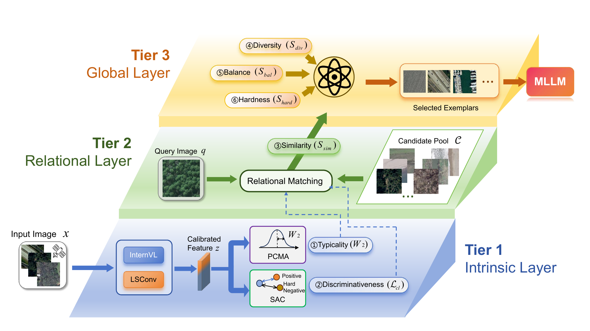

<div align="center">

# IDEA

**Integrated Distribution-aware Exemplar Adaptation for Multimodal Many-Shot ICL in Remote Sensing**

Yi Feng, Silu Gao, Aiping Yang

Tianjin University

[](https://www.python.org/)
[](LICENSE)

</div>

## Overview

IDEA is a training-free many-shot in-context learning framework for remote
sensing image classification with frozen multimodal large language models.
It addresses a central failure mode of conventional retrieval: point-wise
visual similarity can select atypical, noisy, or hard-negative demonstrations
when remote sensing scenes have high intra-class variation and strong
inter-class ambiguity.

IDEA constructs each context using six complementary criteria: **similarity**,
**balance**, **diversity**, **hardness**, **typicality**, and
**discriminativeness**. The framework has three tiers:

- **Intrinsic layer:** Dual-Stream LSConv Calibration adds spatial inductive
  bias to frozen MLLM features; PCMA measures class-manifold typicality; SAC
  suppresses confusing hard negatives.
- **Relational layer:** query-candidate similarity measures relevance to the
  current query.
- **Global layer:** diversity, class balance, and hard-class coverage shape the
  complete demonstration sequence.

<p align="center">
  
</p>

## Highlights

- Parameter-update-free adaptation of a frozen InternVL2.5-8B backbone.
- Distribution-aware exemplar evaluation through **Probabilistic Calibration
  and Matching Alignment (PCMA)** and Wasserstein distance.
- Contrastive hard-negative suppression through **Self-Supervised Alignment
  Contrast (SAC)**.
- Structure-aware feature calibration using two frozen, ImageNet-pretrained
  LSConv blocks.
- Reliable context construction across different many-shot budgets.

## Requirements

- Python >= 3.10
- PyTorch >= 2.0
- CUDA-capable GPU for InternVL2.5-8B inference
- [InternVL2.5-8B](https://huggingface.co/OpenGVLab/InternVL2_5-8B)
- ImageNet-1K pretrained LSNet-T checkpoint named `lsnet_t.pth`

The paper experiments use PyTorch 2.8.0, CUDA 12.8, and Transformers 4.37.2.
See [`requirements.txt`](requirements.txt) for the complete dependency list.

## Installation

```bash
git clone https://github.com/hava-idea/IDEA.git
cd IDEA
pip install -r requirements.txt
pip install -e .
```

## Model Preparation

Download InternVL2.5-8B and pass its local directory with `--model-path`.
Place the pretrained LSNet-T checkpoint at the repository root:

```text
IDEA/
|-- lsnet_t.pth
`-- ...
```

Alternatively, set an absolute or relative checkpoint path in the YAML file:

```yaml
lsconv:
  checkpoint_path: /path/to/lsnet_t.pth
```

The LSNet-T checkpoint is loaded before the two LSConv blocks are frozen.

## Datasets

We evaluate IDEA on two remote sensing scene classification benchmarks:

| Dataset | Classes | Images per class |
|---|---:|---:|
| UCMerced_LandUse | 21 | 100 |
| RSSCN7 | 7 | 400 |

Both datasets use a class-balanced 70:15:15 train/validation/test split.
Detailed download and layout instructions are available in
[`docs/DATASETS.md`](docs/DATASETS.md).

Expected directory layout:

```text
/data/
|-- UCMerced_LandUse/
|   `-- Images/
|       |-- agricultural/
|       |-- airplane/
|       `-- ...
`-- RSSCN7/
    |-- aGricultural/
    |-- fForest/
    `-- ...
```

## Quick Start

Run IDEA on UCMerced with 20 demonstrations:

```bash
python scripts/run_experiment.py \
  --config configs/ucmerced_20shot.yaml \
  --data-root /data/UCMerced_LandUse \
  --model-path /weights/InternVL2_5-8B \
  --output-dir ./results
```

Run IDEA and all four baselines under the same protocol:

```bash
python scripts/run_experiment.py \
  --config configs/ucmerced_20shot.yaml \
  --data-root /data/UCMerced_LandUse \
  --model-path /weights/InternVL2_5-8B \
  --output-dir ./results \
  --all-methods
```

Use `configs/rsscn7_20shot.yaml` and the RSSCN7 data root for RSSCN7.
Command-line options such as `--shots`, `--seed`, and `--device` override the
corresponding YAML values.

## Main Results

Top-1 accuracy (%) with the frozen InternVL2.5-8B backbone:

| Dataset | Zero-shot | Best IDEA | Shot budget | Best same-budget baseline | Gain over baseline |
|---|---:|---:|---:|---:|---:|
| UCMerced_LandUse | 59.68 | **90.16** | 31 | 42.54 (RICES) | **+47.62** |
| RSSCN7 | 71.43 | **86.43** | 33 | 58.33 (RICES) | **+28.10** |

At 30 shots, the component ablation is:

| LSConv | PCMA | SAC | UCMerced | RSSCN7 |
|:---:|:---:|:---:|---:|---:|
| No | No | No | 64.44 | 72.62 |
| No | Yes | No | 76.51 | 75.71 |
| No | No | Yes | 72.06 | 74.76 |
| No | Yes | Yes | 80.00 | 78.10 |
| Yes | No | No | 74.92 | 78.33 |
| Yes | Yes | Yes | **87.62** | **84.76** |

## Project Structure

```text
IDEA/
|-- assets/                 # README figures
|-- configs/                # Dataset-specific experiment configurations
|-- docs/                   # Dataset preparation instructions
|-- scripts/                # Experiment entry point
|-- src/idea/               # IDEA and baseline implementations
|-- tests/                  # Paper-alignment and regression tests
|-- requirements.txt
`-- README.md
```

Core modules:

| File | Responsibility |
|---|---|
| `feature_calibration.py` | Dual-stream semantic and structural calibration |
| `lsconv.py` | LSConv blocks and pretrained LSNet-T weight loading |
| `probabilistic_alignment.py` | PCMA class manifolds and typicality scores |
| `self_supervised_alignment.py` | SAC hard-negative contrastive scores |
| `selection.py` | Adaptive six-criterion sequence selection |
| `experiment.py` | End-to-end evaluation pipeline and baselines |

## Testing

```bash
pytest tests/ -v
```

## Citation

If you find this work useful, please cite:

```bibtex
@misc{feng2026idea,
  title  = {IDEA: Integrated Distribution-aware Exemplar Adaptation for
            Multimodal Many-Shot ICL in Remote Sensing},
  author = {Feng, Yi and Gao, Silu and Yang, Aiping},
  year   = {2026},
  note   = {Manuscript}
}
```

## License

This project is released under the [MIT License](LICENSE).
